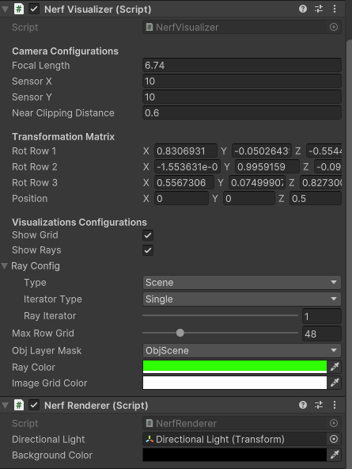

# NeRF Visualization using Unity
There are so many NeRF implementations, yet, the way ray projects from the camera unto the scene is not really well explained. 
This project aims to visualize exactly how the ray projection from camera to the image plane, the effect of focal length, sensor size of the camera, etc.

Implemented using Unity 2022.3.0f1 LTS.

## Camera Fundamentals
The camera in this project models the pinhole camera as shown below:

## Script Parameters

- `Camera Configurations` controls the camera intrinsic parameters as shown in the image above.
- `Transformation Matrix` shows the rotation matrix and the position of the camera.
- `Show Grid` shows the grid on the image plane.
- `Show Rays` shows the rays projected from the camera to the image plane.
- `Ray Config`,
    - Type `Scene` will project the rays from the camera until they intersect with the scene.
    - Type `Image` will project the rays from the camera until they intersect with the image plane.
- `Iterator Type`,
    - `Single` will show only one ray.
    - `Accumulate` will show all the rays up to the current ray.
- `Ray Iterator` controls how much ray is projected from the camera.
- `Max Row Grid` controls the pixel resolution of the image plane.
- `Obj Layer Mask` controls which layer the ray will intersect with. Put all the objects in the scene in this layer.
- The rest are self-explanatory.

## Disclaimer
- The code is not optimized for performance as the objective is to simply visualize the ray projection.
- All scripts are **executed in edit mode**, you don't need to play the scene. However, be aware of the changes you make in the scene as it will be saved.
- The rendering part of this image is simply using Lambertian shading, so it does not take into account the volumetric rendering as in the NeRF paper.
